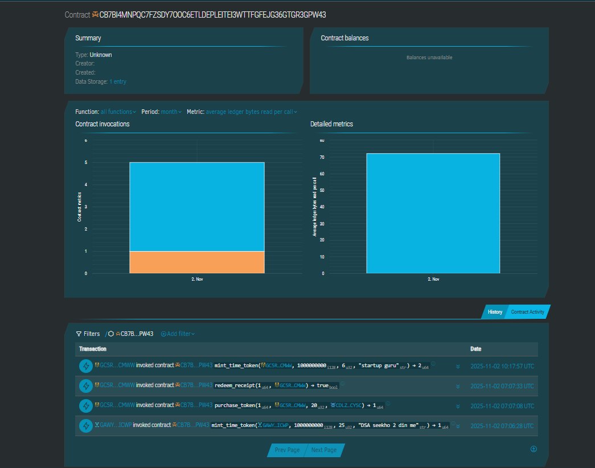

# ⏰ Time.Fun – Tradeable Tokens for Human Time

## Project Description

Time.Fun is a decentralized smart contract solution built on the Stellar blockchain using Soroban SDK. This innovative platform transforms human time into tradeable digital assets, allowing individuals to mint, buy, sell, and redeem "time tokens" where each token represents one hour of availability for mentorship, meetings, or collaborations. The system provides a transparent, secure, and efficient marketplace for time-based services while eliminating traditional intermediaries and establishing verifiable on-chain reputation systems.

## Project Vision

Our vision is to revolutionize how human expertise and time are valued and exchanged in the digital economy. We aim to:

- **Democratize Access to Expertise**: Remove geographical and financial barriers to connecting with experts, mentors, and professionals worldwide
- **Empower Individual Monetization**: Enable anyone to monetize their knowledge and time through a fair, transparent marketplace
- **Build Reputation Systems**: Create verifiable, on-chain credential systems that preserve the value of commitment and expertise
- **Promote Fair Value Exchange**: Ensure transparent pricing mechanisms that reflect true market value for different types of expertise
- **Foster Global Collaboration**: Connect individuals across borders for knowledge sharing, mentorship, and professional development
- **Reduce Transaction Friction**: Eliminate intermediaries and their associated fees, ensuring maximum value for both time sellers and buyers

## Key Features

### 1. Time Token Minting
- Content creators and professionals can mint personalized time tokens representing their available hours
- Each token is uniquely linked to the creator's blockchain address with customizable metadata
- Simple initialization process requiring minimal technical expertise
- Flexible token supply management based on actual availability

### 2. Decentralized Marketplace
- Browse and discover time tokens from experts across various fields and industries
- Search and filter functionality by expertise, price, rating, and availability
- Real-time price discovery based on supply and demand dynamics
- Seamless wallet integration for purchasing tokens with Stellar Lumens (XLM)

### 3. Token Redemption System
- Token holders can redeem tokens to book time slots with creators
- Automated scheduling integration for seamless appointment setting
- Optional messaging feature for session preparation and context sharing
- Instant confirmation with blockchain verification

### 4. Comprehensive Balance Tracking
- Real-time monitoring of token balances for all users
- Historical transaction records with complete audit trails
- Track minted, sold, purchased, and redeemed tokens separately
- Transparent view of available vs. committed time

### 5. Secure Token Management
- Built-in authentication mechanisms ensuring only authorized transactions
- Burn functionality automatically executed upon time redemption
- Transfer capabilities for token trading on secondary markets
- Immutable records stored on the Stellar blockchain

### 6. Wallet Integration
- Seamless connection with Stellar wallets (Freighter, Albedo, etc.)
- One-click authentication for streamlined user experience
- Secure transaction signing and confirmation
- Multi-wallet support for flexibility

## Future Scope

### Short-term Enhancements (3-6 months)

- **Dynamic Pricing Models**: Implement market-driven pricing based on demand, reputation, and time of day
- **Calendar Integration**: Direct synchronization with Google Calendar, Outlook, and other scheduling tools
- **Rating & Review System**: Enable buyers to rate and review their sessions, building creator reputation
- **Advanced Search Filters**: Add filtering by industry, expertise level, languages spoken, and time zones
- **Notification System**: Real-time alerts for token purchases, redemptions, and scheduling updates

### Mid-term Development (6-12 months)

- **NFT Time Tokens**: Convert time tokens into unique NFTs with collectible properties and metadata
- **Reputation Layer**: Integrate verifiable credentials from platforms like LinkedIn, GitHub, and educational institutions
- **Subscription Packages**: Offer bundled time tokens at discounted rates for recurring mentorship or consultations
- **Group Sessions**: Enable creators to offer multi-participant sessions with shared token redemption
- **Escrow System**: Implement secure escrow for high-value time commitments with dispute resolution
- **Analytics Dashboard**: Provide creators with insights into token performance, buyer demographics, and revenue metrics
- **Multi-token Tipping**: Allow buyers to add bonus tips beyond the standard token price
- **Referral Program**: Reward users for bringing new creators and buyers to the platform

### Long-term Vision (12+ months)

- **Cross-chain Compatibility**: Expand to support Ethereum, Polygon, and other blockchain networks
- **DAO Governance**: Implement decentralized governance for platform fees, features, and policy decisions
- **Creator Collectives**: Enable teams and organizations to pool their time tokens for collaborative offerings
- **Advanced Matching Algorithm**: AI-powered recommendations connecting buyers with ideal creators based on needs and history
- **Mobile Applications**: Develop native iOS and Android apps for on-the-go token management
- **Automated Royalties**: Smart contract-based revenue sharing for collaborative sessions or affiliate partnerships
- **Compliance Tools**: Integrate tax reporting and regulatory compliance features for different jurisdictions
- **Fiat Integration**: Enable seamless conversion between cryptocurrency and traditional currencies
- **Video Conference Integration**: Built-in video calling capabilities directly within the platform
- **Certification Programs**: Issue blockchain-verified certificates for completed mentorship programs or educational sessions

### Technical Improvements

- **Gas Optimization**: Continuously improve smart contract efficiency to minimize transaction costs
- **Scalability Solutions**: Implement layer-2 solutions for handling high transaction volumes during peak demand
- **Enhanced Security Audits**: Regular third-party security audits and community-driven bug bounty programs
- **Open-Source SDK**: Develop comprehensive SDKs for developers to build custom applications on top of Time.Fun
- **API Expansion**: Create robust REST and GraphQL APIs for third-party integrations and extensions
- **Decentralized Storage**: Integrate IPFS or Arweave for storing session notes, recordings, and materials
- **Privacy Features**: Optional anonymous booking for sensitive consultations while maintaining blockchain integrity

---

## 🚀 Getting Started

### Prerequisites

- **Rust** (latest stable version)
- **Node.js** (v16 or higher)
- **npm** or **yarn**
- **Stellar wallet** (Freighter recommended)
- **Soroban CLI** (for contract deployment)

### Installation

1. **Clone the repository**
   ```bash
   git clone https://github.com/yourusername/stellar-time-marketplace.git
   cd stellar-time-marketplace
   ```

2. **Install contract dependencies**
   ```bash
   cd contracts
   cargo build --target wasm32-unknown-unknown --release
   cd ..
   ```

3. **Install frontend dependencies**
   ```bash
   cd frontend
   npm install
   cd ..
   ```

4. **Configure environment variables**
   ```bash
   cp .env.example .env
   # Edit .env with your configuration
   ```

### Deployment

1. **Deploy the smart contract**
   ```bash
   cd scripts
   node deploy.js
   ```

2. **Run the frontend locally**
   ```bash
   cd frontend
   npm run dev
   ```

3. **Access the application**
   
   Open your browser and navigate to `http://localhost:5173` (or the port shown in terminal)

---

## 📁 Project Structure

```
stellar-time-marketplace/
├── contracts/
│   ├── time_token.rs          # Core smart contract for time token management
│   └── Cargo.toml             # Rust dependencies and configuration
│
├── frontend/
│   ├── src/
│   │   ├── index.html         # Main application interface
│   │   ├── app.js             # Frontend application logic
│   │   ├── styles.css         # UI styling
│   │   └── components/
│   │       ├── wallet.js      # Wallet connection & management
│   │       ├── marketplace.js # Marketplace browsing & trading
│   │       └── token-manager.js # Token minting & redemption
│   ├── package.json           # Frontend dependencies
│   └── vite.config.js         # Build configuration
│
├── scripts/
│   ├── deploy.js              # Smart contract deployment script
│   └── setup.js               # Initial marketplace configuration
│
├── tests/
│   └── time_token.test.js     # Smart contract test suite
│
├── .env.example               # Environment variable template
├── package.json               # Project dependencies
├── todo.md                    # Development roadmap
└── README.md                  # This file
```

---

## 💡 Usage

### For Time Sellers (Creators)

1. **Connect Wallet**: Link your Stellar wallet to the platform
2. **Initialize Profile**: Set up your creator profile with expertise and bio
3. **Mint Tokens**: Create time tokens representing your available hours
4. **Set Pricing**: Define the value for your time based on market demand
5. **List on Marketplace**: Make your tokens discoverable to potential buyers

### For Time Buyers (Supporters)

1. **Browse Marketplace**: Explore available time tokens from various experts
2. **Research Creators**: View profiles, ratings, and previous buyer reviews
3. **Purchase Tokens**: Buy tokens using Stellar Lumens (XLM)
4. **Redeem Time**: Schedule and book sessions with token creators
5. **Provide Feedback**: Rate and review your experience to build creator reputation

---

## 🤝 Contributing

We welcome contributions from the community! Here's how you can help:

1. **Fork the repository**
2. **Create a feature branch** (`git checkout -b feature/amazing-feature`)
3. **Commit your changes** (`git commit -m 'Add amazing feature'`)
4. **Push to the branch** (`git push origin feature/amazing-feature`)
5. **Open a Pull Request**

###Contract details
contract id:CA3AO4TOOVS66AXW7NQLDCBDTCTFSPN2MDVHMKIXMG47MZSGQERTA7R


